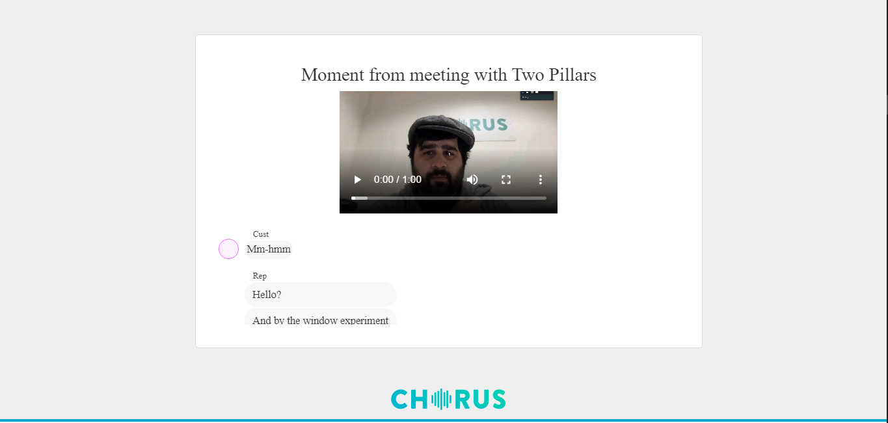
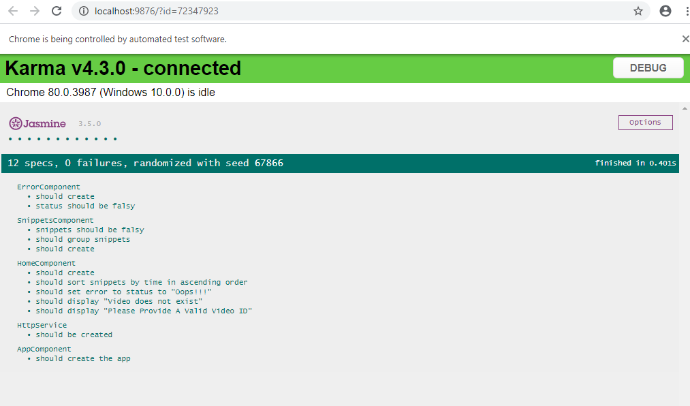

# Angular Coding Excurse

# Introduction

This project was created on 
> Screen Width: 1366 pixels
> Screen Height: 768 pixels

# Getting Started

Run `ng serve` for a dev server. Navigate to `http://localhost:4200/`. The app will automatically reload if you change any of the source files.

# Error Handling
The following Errors were handled:
1) ID does not exist
2) No ID provided

# Testing

12 Unit Tests were performed. 
Run `ng test`

# Optimization
__Performance__: The app was optimized to reduce compilation time
__Responsiveness__: The app was optimized to look better on smaller and larger screens
__Refactoring__: This yields a great benefits like making maintenance and debugging easier. The following were refactored into different components:
    * Video component
    * Transcript component
    * Error component

# Security
Most of the attacks on web applications originate from the client side, and it is very essential to ensure that the client side of any application is well protected against most attacks. From my experience in cyber-security, I ensured the following attacks were conntrolled.

__Cross-Site Scripting Attack__: To prevent XSS attacks, malicious codes must be blocked from entering the DOM or getting to the server. By default, Angular systematically block XSS bugs by treating all values as untrusted.

__DOM Interaction__: Interacting with other APIs that manipulate the DOM will likely expose the application to vulnerabilities. The easiest ways to control this is by, using Angular built-in santization functions, santizing untrusted values and avoiding any direct interaction with the DOM. In consideration to the control methods mentioned, all values used in this code are trusted and I avoided any direct interaction with the DOM, ensuring that no scripts, elements or properties were inserted into the DOM

__Content Security Policy__: This is a defense-in-depth mechanism to prevent XSS attacks. According to the Same Origin Policy, accessing an external API would possibly generate a CORS-HEADER-ERROR. This will cause the app to display a "VIDEO WITH THE PROVIDED ID DOES NOT EXIST". This is not an Angular Error but general to web applications. The best way to fix this is by modifying the server. Since I don't have access to modifying the server, a temporary solution was adopted and that is disabling SAME ORIGIN POLICY on your browser. 
__Please Note: this is a very UNSECURED PROCESS, and can leave you vulnerable to other web attacks__.
The best way to control this on Chrome Browser is to install the CORS ACCESS-CONTRL-ALLOW-ORIGIN Chrome Extension by Muyor and clearing your site cache and cookies.

## Build

Run `ng build` to build the project. The build artifacts will be stored in the `dist/` directory. Use the `--prod` flag for a production build.

## Running unit tests

Run `ng test` to execute the unit tests via [Karma](https://karma-runner.github.io).

## Running end-to-end tests

Run `ng e2e` to execute the end-to-end tests via [Protractor](http://www.protractortest.org/).
